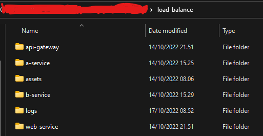
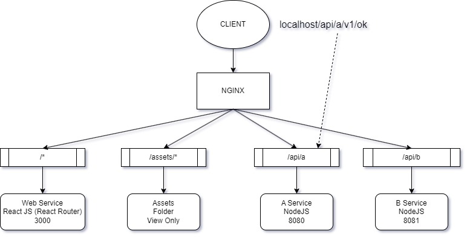
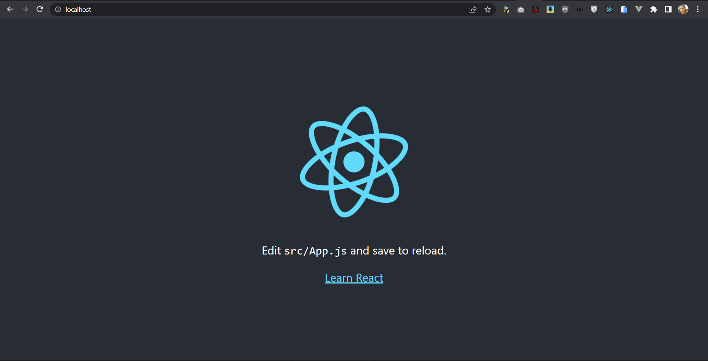
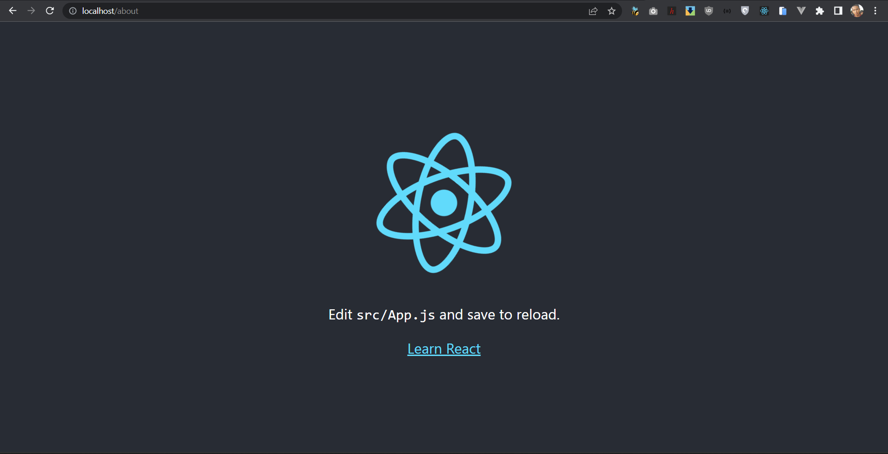
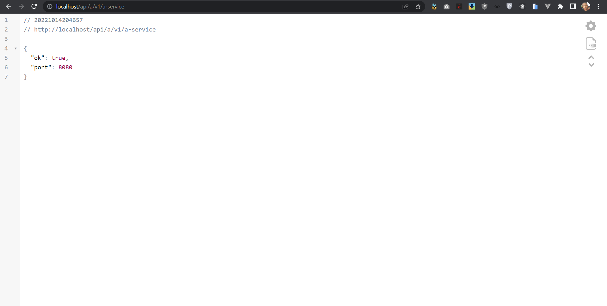
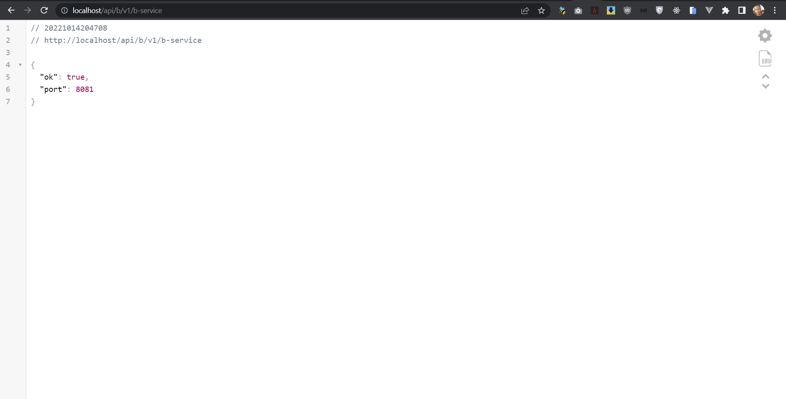
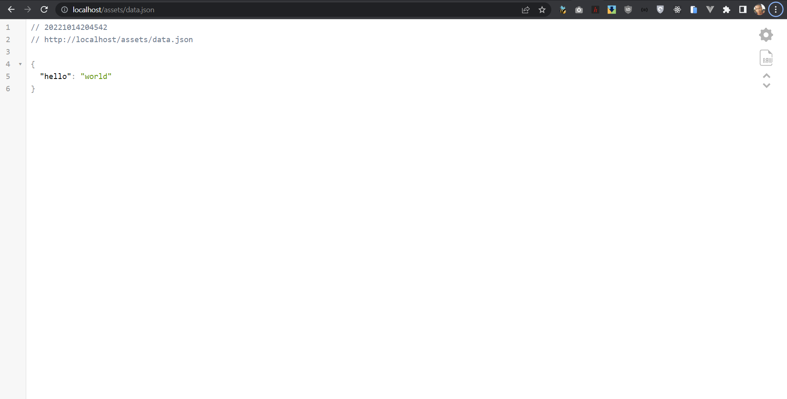

# NGINX Load Balance Microservice

**baca terlebih dahulu sampai bawah/selesai sebelum clone repo ini...**

## Folder Structure
```
load-balance
│
└───Web Service
│       file project...
│
└───A Service
│       file project...
│
└───B Service
│       file project...
│
└───Assets
        data.json
        more file...
```


## How to Use
1. install Docker Desktop or Docker (whatever)
2. create container :
```bash
docker-compose up -d
```
3. create all container microservices testing (link bellow)

## clone all microservices testing
- [Web Service](https://github.com/jefripunza/example-web-service.git)
- [A Service](https://github.com/jefripunza/example-a-service.git)
- [B Service](https://github.com/jefripunza/example-b-service.git)


## URL Testing (result)
- React JS [http://localhost](http://localhost)
  
  
- A Service [http://localhost/api/a](http://localhost/api/a)
  
- B Service [http://localhost/api/b](http://localhost/api/b)
  
- Assets Folder [http://localhost/assets/data.json](http://localhost/assets/data.json)
  

Note :
- clone semua ini didalam 1 folder (seperti di **Folder Structure**)
- buatlah sebuah file **data.json** lalu isi dengan data json (whatever)
- masukan beberapa file di folder **assets** dan coba buka lewat endpoint **assets** seperti **data.json**
